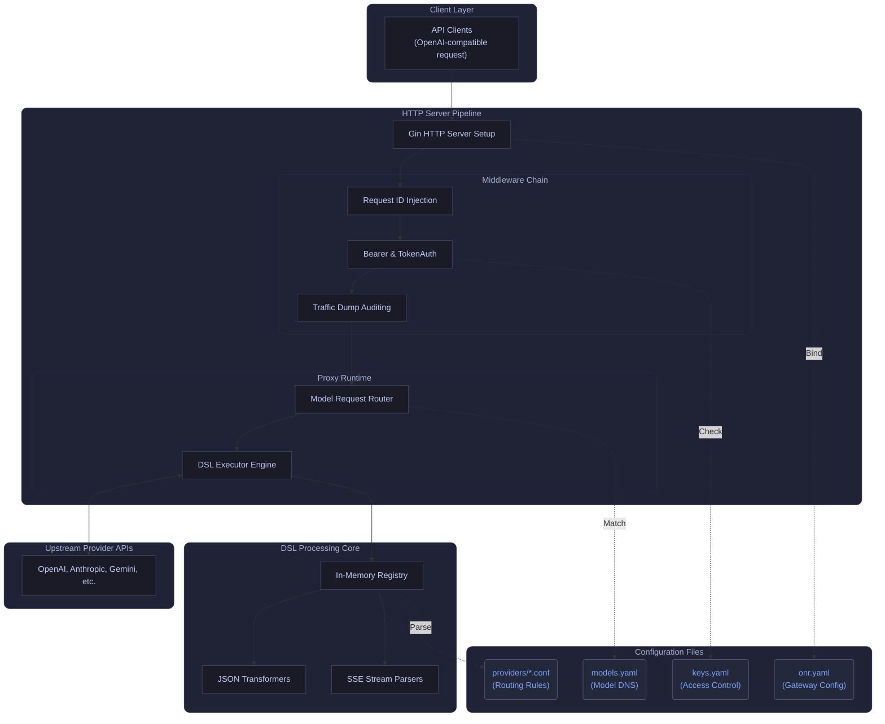

## A DSL-driven LLM gateway

Open Next Router (ONR) routes requests, applies opt-in compatibility transforms, and normalizes streaming behavior across providers, without hiding logic in code.

<div className="flex flex-wrap gap-3 mt-6">
  <Button href="/getting-started/quickstart">Get started</Button>
  <Button href="/dsl/overview" variant="secondary">Read the DSL model</Button>
</div>

<Callout type="info" title="Design principle">
  Runtime behavior must be described explicitly by DSL directives in `config/providers/*.conf` (see [config/providers](https://github.com/r9s-ai/open-next-router/tree/main/config/providers)). The runtime proxy stays an execution engine, not a guessing layer.
</Callout>

## Architecture at a Glance



## Jump in

<Cards>
  <Card title="Quickstart" href="/getting-started/quickstart">
    Run locally, validate configs, and hit `/v1/models`.
  </Card>
  <Card title="Configuration" href="/configuration/onr-yaml">
    `onr.yaml`, `keys.yaml`, `models.yaml`, reload and env overrides.
  </Card>
  <Card title="DSL" href="/dsl/overview">
    `defaults` + `match`, phases, directives, and streaming transforms.
  </Card>
  <Card title="API" href="/api/overview">
    OpenAI-compatible endpoints plus Gemini v1beta subset.
  </Card>
</Cards>

## 30-second Quickstart

```bash
make build
onr run -c onr.yaml
curl -sS http://127.0.0.1:3300/v1/models -H "Authorization: Bearer change-me"
```

## What you get

- **Atomic DSL**: declare routing/auth/transforms/SSE parsing in config, not code.
- **Safe defaults**: first match wins; no-match returns HTTP 400 (no silent fallback).
- **Streaming-aware**: normalize SSE framing and provider chunk semantics.
- **Ops-friendly**: one-line access logs, optional traffic dumps, optional usage/cost extraction.

## Where to Start

- Start with [Quickstart](/getting-started/quickstart).
- Skim [Why ONR](/concepts/why-onr) and [Architecture](/concepts/architecture).
- Read [DSL Overview](/dsl/overview), then author provider files with [Provider Config](/reference/provider-config).
